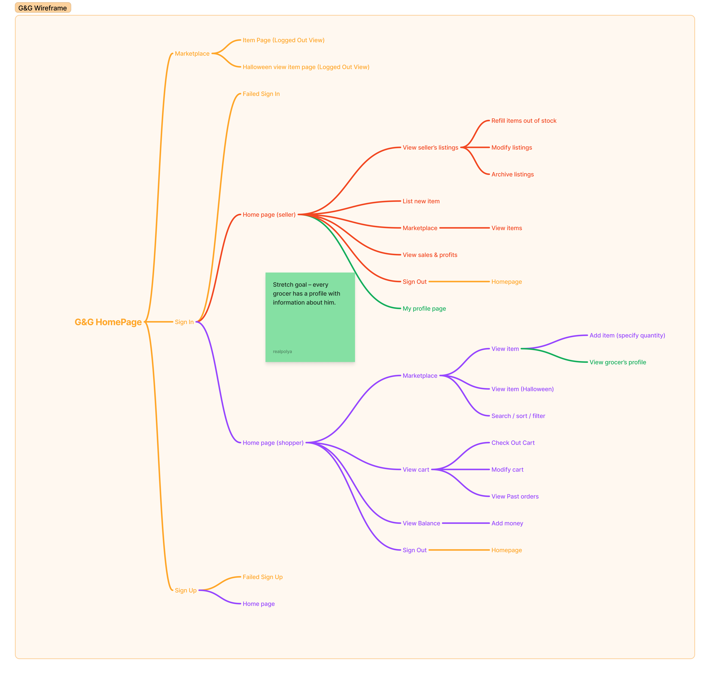
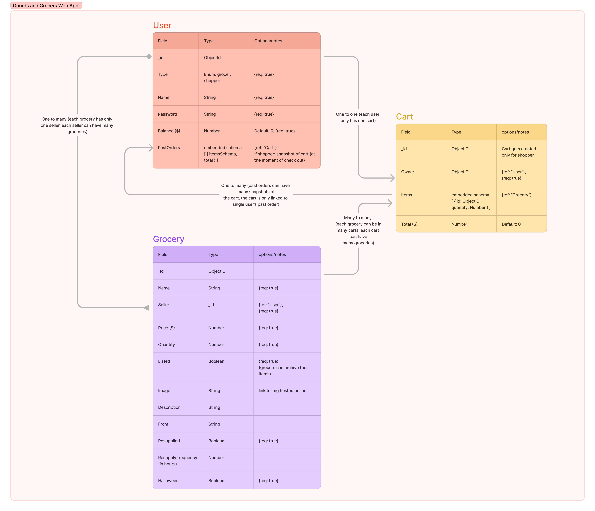
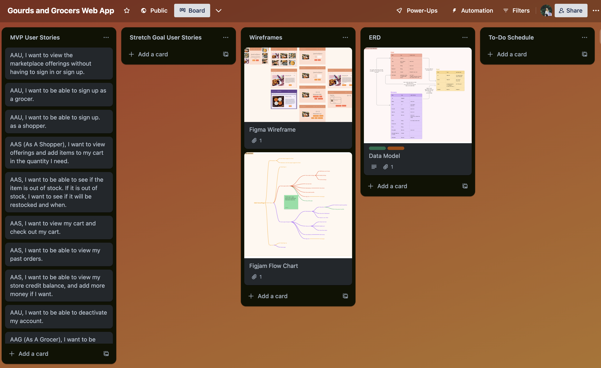
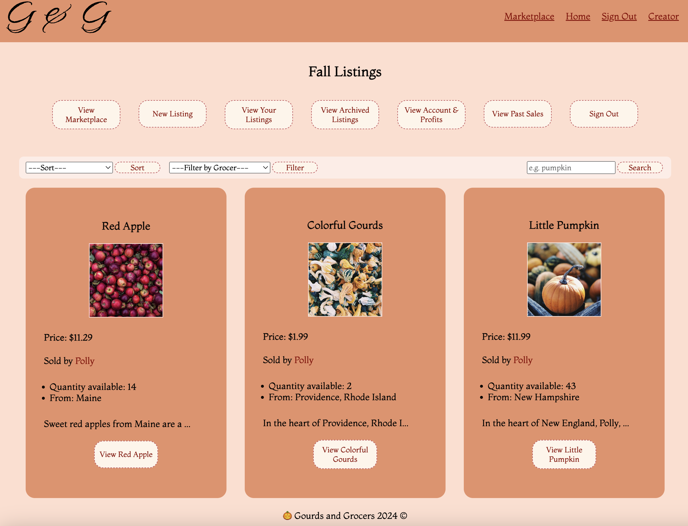
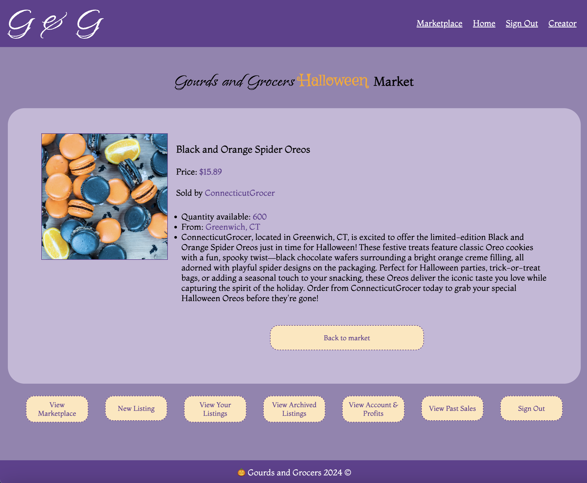
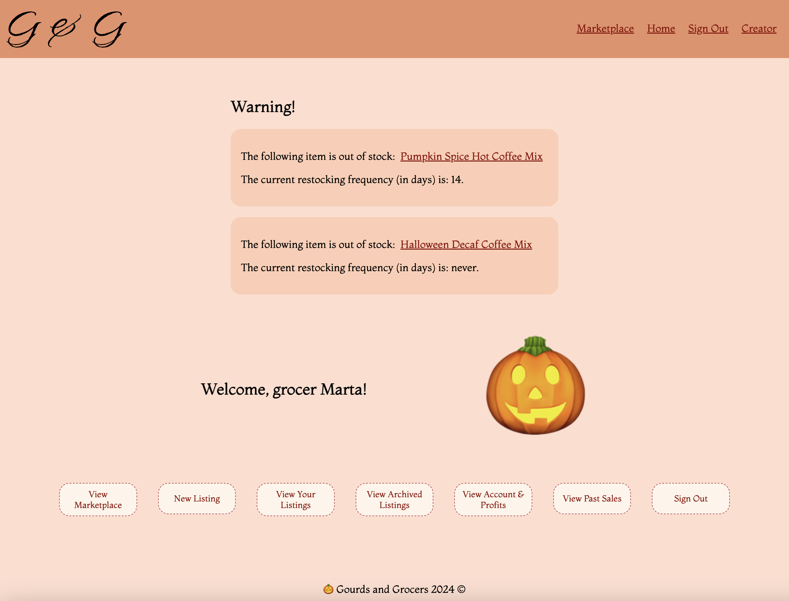
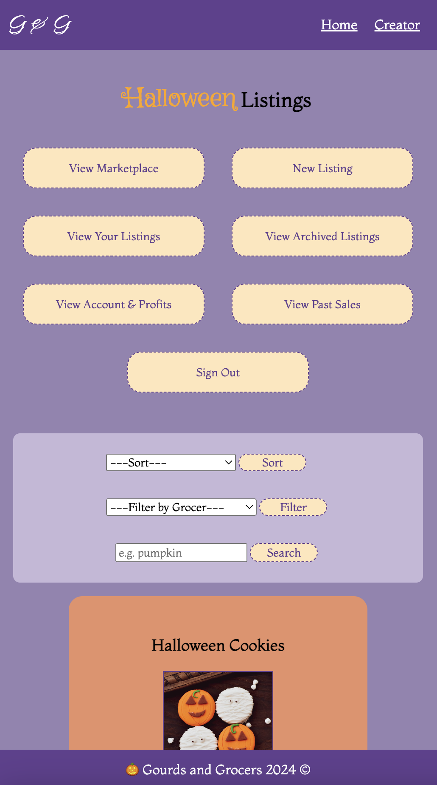
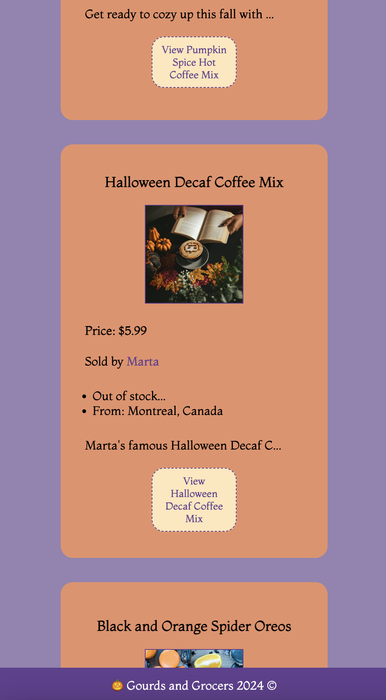
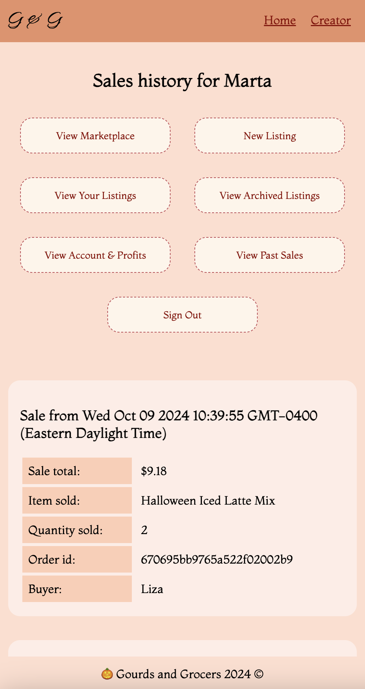

# Gourds and Grocers Market 🎃

[**Gourds and Grocers**](https://gourds-and-grocers-fc1e690d830c.herokuapp.com/) is a web application that models real-world e-commerce website focusing on grocery retailers selling fall seasonal items.

## Planning Phase

### User Stories

As a User (AAU):
* AAU, I want to view the marketplace offerings without having to sign in or sign up. I want to be able to search items, sort and filter them.
* AAU, I want to be able to sign up as a grocer.
* AAU, I want to be able to sign up as a shopper.
* AAU, I want to be able to deactivate my account.

As a Shopper (AAS):
* AAS, I want to view offerings and add items to my cart in the quantity I need.
* AAS, I want to be able to see if the item is out of stock. If it is out of stock, I want to see if it will be restocked and when.
* AAS, I want to view my cart and check out my cart.
* AAS, I want to be able to view my past orders.
* AAS, I want to be able to view my store credit balance, and add more money if I want.

As a Grocer (AAG):
* AAG, I want to be able to create a listing for the item I am selling. I want to specify the quantity and price.
* AAG, I want to be able to view my listings.
* AAG, I want to be able to modify my listings, change price / quantity / description (etc), or archive my listings.
* AAG, I want to be able to view my profits and sales.


### Wireframe
Wireframe work was completed using Figma.


Flow chart work was completed using FigJam.



### Color palettes

Main color palette:


Halloween color palette:


``` css
:root {
    --main-color: #FFDECF;
    --accent-color: #E79069;
    --dark-color: #A36B61;
    --red-color: #C4515B;
    --darkred-color: darkred;
    --light-color: #FFECE6;
    --text-accent-color: darkred;
    --button-color: #FFF5EA;
    --halloween-orange: #FFE6BB;
    --halloween-orange-font: orange;
    --halloween-main-color: #9583B1;
    --halloween-dark-color: #624090;
    --halloween-text-accent-color: #624090;
}
```

### Entity Relationship Diagram (ERD)

ERD work was completed using FigJam. The data models use both embedding and referencing. ```Cart``` model utilizes subschema for items in the cart (item id and quantity). All three models reference each other.



### Trello

Visit the [Trello board](https://trello.com/invite/b/66feb6176c1bcc2536c185a2/ATTI8316b2cb783b5f6d5f2cde6bac6a100bEB6DE678/gourds-and-grocers-web-app) for the project.



## Technologies Used

* Node.js
* Express.js
* MongoDB, Mongoose
* HTML / CSS / JavaScript
* npm packages:

``` js
"dependencies": {
    "bcrypt": "^5.1.1",
    "dotenv": "^16.4.5",
    "ejs": "^3.1.10",
    "express": "^4.21.0",
    "express-session": "^1.18.0",
    "method-override": "^3.0.0",
    "mongoose": "^8.7.0",
    "morgan": "^1.10.0",
    "serve-favicon": "^2.5.0"
  }
```

## Routes

| Route    | Method | Description | Need sign-in? |
| -------- | ------- | ------- | ------- | 
| ```/``` | GET | Render home page of the website | No |

### Auth.js Controller

| Route    | Method | Description | Need sign-in? |
| -------- | ------- | ------- | ------- |
| ```/auth/sign-up``` | GET | Render sign-up page | No |
| ```/auth/sign-in``` | GET | Render sign-in page | No |
| ```/auth/sign-out``` | GET | Sign user out and destroy req.session | No |
| ```/auth/sign-up``` | POST | Sign user up | No |
| ```/auth/sign-in``` | POST | Sign user in | No |

### Market.js Controller

| Route    | Method | Description | Need sign-in? |
| -------- | ------- | ------- | ------- |
| ```/market``` | GET | Render market page | No |
| ```/market/sort``` | GET | Display sorted market page | No |
| ```/market/filter``` | GET | Display filtered market page | No |
| ```/market/search``` | GET | Display searched market page | No |
| ```/market/item/:id``` | GET | Render item page | No |
| ```/market/signed-in``` | GET | Render market page | Yes |
| ```/market/signed-in/sort``` | GET | Display sorted market page | Yes |
| ```/market/signed-in/filter``` | GET | Display filtered market page | Yes |
| ```/market/signed-in/search``` | GET | Display searched market page | Yes |
| ```/market/item/:id/shop``` | GET | Render item page | Yes |

### Groceries.js Controller

| Route    | Method | Description | Need sign-in? |
| -------- | ------- | ------- | ------- |
| ```/groceries``` | GET | Render grocer's listings page | Yes |
| ```/groceries/home``` | GET | Render grocer's home page | Yes |
| ```/groceries/archived``` | GET | Render grocer's archived listings page | Yes |
| ```/groceries/new``` | GET | Render grocer's new listing page | Yes |
| ```/groceries/account``` | GET | Render grocer's account page | Yes |
| ```/groceries/history``` | GET | Render grocer's past sales page | Yes |
| ```/groceries/:id``` | GET | Render grocer's single listing page | Yes |
| ```/groceries/:id/edit``` | GET | Render grocer's single listing's edit page | Yes |
| ```/groceries``` | POST | Post new listing | Yes |
| ```/groceries/account/deactiv``` | PUT | Deactivate grocer's account | Yes |
| ```/groceries/:id/inactive``` | POST | Archive listing | Yes |
| ```/groceries/:id/relist``` | POST | Reactivate listing | Yes |
| ```/groceries/:id``` | PUT | Update existing listing | Yes |


### Shop.js Controller

| Route    | Method | Description | Need sign-in? |
| -------- | ------- | ------- | ------- |
| ```/shop``` | GET | Render shopper's home page | Yes |
| ```/shop/account``` | GET | Render shopper's account page | Yes |
| ```/shop/history``` | GET | Render shopper's past orders page | Yes |
| ```/shop/account``` | PUT | Update account's store credit  | Yes |
| ```/shop/account/deactiv``` | PUT | Deactivate shopper's account  | Yes |

### Cart.js Controller

| Route    | Method | Description | Need sign-in? |
| -------- | ------- | ------- | ------- |
| ```/cart``` | GET | Get shopper's cart view | Yes |
| ```/cart/:id``` | POST | Add grocery item to the cart | Yes |
| ```/cart/:id/remove``` | PUT | Remove grocery item from the cart | Yes |
| ```/cart/clear``` | PUT | Clear cart | Yes |
| ```/cart/checkout``` | PUT | Check out cart | Yes |

## Pages

#### *Marketplace page*


#### *Halloween item page*


#### *Grocer home page*


### Mobile versions

#### *Halloween market mobile page*




#### *Grocer's sales history page*


### JS model files

* model-user.js

Defines mongoose model for User – both grocers and shoppers. User chooses the type of account upon signing up. Shopper users store an array of objects within the ```pastOrders``` variable, and this object is defined in the ```orderSchema``` subschema. The ```items``` variable within the ```orderSchema``` store an array of obejcts from the previously checked out cart. **It is ultimately an array of objects within an object that is within an array of objects.**

* model-grocery.js

Defines mongoose model for Grocery item, and can be added only by Grocers. Each Grocery item can be archived by switching the ```listed``` value to false. The ```image``` key retrieves the image from the url from the web. The ```seller``` key points to the ```User``` model's id. 

* model-cart.js

Defines mongoose model for Cart item, and it is created for every shopper when they sign up. It is a one-to-one relationship. Cart model has an embedded subschema ```cartItemSchema``` that references the id of the ```Grocery``` and specifies the quantity in cart. ```Cart.items``` is an array of objects that originate from such subchema. Cart gets cleared every time a transaction happens. 


## Future improvements

* ### Combining User and Grocer Into One User

It would be an important next step – give dual functionality to a single account, so grocers can have carts and shop, while shoppers can also create listings and sell. Routes would need to change, and it might become confusing.

* ### Restocking Items Automatically

The grocer specifies whether the item is restocked in the following ```Grocery``` model's excerpt. 

``` js
quantity: {
        type: Number,
        required: true,
        default: 1
    },
resupplied: {
        type: Boolean,
        required: true,
    },
frequency: Number,
```

It would be a great next step to create a timer mechanism where if the ```quantity``` is equal to 0, the timer sets off and automatically replenishes the stock once it reaches the ```frequency``` value.

* ### Drag and Drop Image for Listing

At this point, the grocers have to add publicly available images via links. It would be great to add a drag-and-drop feature for images added locally and uploaded to the server.

* ### Cleaner Code

The code has redundant functions and routes that could be optimized.

* ### Arrays of Objects in Array of Objects Complexity

As the database grows, the time to retrieve data would get longer and longer as the Big O of nested loops present in the project isof quadratic complexity (if not cubic...). The models reference each  other and create a lot of arrays of objects within arrays of objects (especially for past orders), and it becomes complicated to retrieve data. Maybe creating another data model would help with that instead of embedding within embedding.

---------

### Sources

* Unsplash (stock images)
* chatGPT (item description generator)